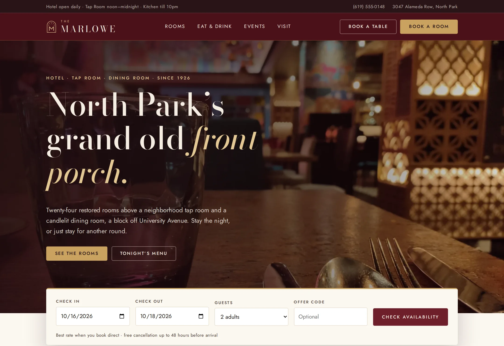

# The Marlowe

Website for The Marlowe, a restored 1926 hotel, tap room and dining room in North Park, San Diego.

**Live demo:** https://www.freelancerportfoliohub.com/jameslee/projects/marlowe/index.html



## Overview

The hotel, the Tap Room and the Dining Room used to run three separate sites: a page-builder
theme, a bar site with a sports-schedule plugin and a menu microsite of PDFs. This repository
merges them into one Next.js site that puts the right booking in front of every visitor, whether
that's a room, a table or a wedding weekend.

Rooms, rates, menus, weekly specials, event spaces and hours are typed data in `lib/data`, so the
team edits them once. Old URLs from all three sites, including the retired domains, are
permanently redirected.

## Features

- **Five pages**: home with an availability bar in the hero, Rooms, Eat & Drink, Events and Visit
- **Room booking widget**: the hero bar hands the stay to the booking panel on `/rooms`, which
  calls `GET /api/availability` for live room counts, nightly rates (weekend pricing), offer codes
  and totals, then sends a booking request to `POST /api/bookings`, re-priced on the server
- **Table reservations**: `POST /api/reservations`, aware that the Dining Room is closed Mondays
  while the Tap Room is open daily
- **Event enquiries**: date, headcount, occasion and space; `POST /api/enquiries` suggests the
  smallest room that seats the party
- **Contact and newsletter** route handlers
- **Menus as HTML**: Dining Room, bar food and cocktails with dietary tags, plus weekly specials
- **Local SEO**: a `Hotel` JSON-LD graph with room offers, the Tap Room (`BarOrPub`) and
  Dining Room (`Restaurant`) as contained places, opening hours from `lib/data/hours.ts`,
  `sitemap.xml`, `robots.txt` and per-page metadata
- **Migration**: 32 permanent redirects in `lib/data/redirects.ts`, including host-based
  redirects for the retired Tap Room and restaurant domains
- Shared zod schemas validate every form in the browser and again in the route handler
- Self-hosted Bodoni Moda and Jost, WebP imagery through `next/image`, an inline SVG map and
  native `<details>` for the mobile menu and FAQs

## Tech stack

- [Next.js 15](https://nextjs.org/) App Router, route handlers, metadata API
- React 19, TypeScript (strict)
- [zod](https://zod.dev/) for validation
- Plain CSS with design tokens (`app/globals.css`)

## Getting started

Requires Node 22 (see `.nvmrc`) and pnpm.

```bash
pnpm install
cp .env.example .env.local
pnpm dev
```

Open http://localhost:3000.

### Environment variables

| Variable                 | Purpose                                                              |
| ------------------------ | -------------------------------------------------------------------- |
| `NEXT_PUBLIC_SITE_URL`   | Canonical origin for metadata, sitemap and JSON-LD                   |
| `PMS_API_URL`            | Property management system inventory endpoint                        |
| `PMS_API_KEY`            | Bearer token for the PMS                                             |
| `FRONT_DESK_WEBHOOK_URL` | Receives booking requests and contact messages                       |
| `TABLES_WEBHOOK_URL`     | Receives table reservations                                          |
| `EVENTS_WEBHOOK_URL`     | Receives event enquiries                                             |
| `NEWSLETTER_WEBHOOK_URL` | Adds subscribers to The Marlowe Letter                               |

Without `PMS_API_URL`, availability comes from a deterministic inventory model that mirrors the
hotel's room counts and rate rules. Without webhooks, submissions are logged to the console.

## Project structure

```
.
├── app/
│   ├── rooms/            Room types, amenities, booking panel
│   ├── dining/           Menus, Tap Room, cocktails, weekly specials, table reservations
│   ├── events/           Spaces, packages, weddings, enquiry form
│   ├── visit/            Info cards, map, FAQs, history, contact form
│   ├── api/              availability, bookings, reservations, enquiries, contact, newsletter
│   ├── sitemap.ts
│   └── robots.ts
├── components/
│   ├── layout/           Topbar, Header, MobileNav, Footer, Brand
│   ├── home/ rooms/ dining/ events/ visit/
│   ├── sections/         PageHero, CtaStrip, SplitMedia, Testimonials
│   ├── seo/              JSON-LD
│   └── ui/               Button, Field, SectionHead, Deco, Ticks…
├── lib/
│   ├── data/             rooms, menus, specials, events, hours, content, nav, redirects
│   ├── validation/       zod schemas shared by forms and route handlers
│   ├── availability.ts   inventory sources and rate calculation
│   ├── services.ts       tables, enquiries, contact
│   └── schema.ts         Hotel JSON-LD graph
├── public/               images and fonts
├── types/
└── next.config.ts        redirects and security headers
```

## Scripts

| Script           | Description                         |
| ---------------- | ----------------------------------- |
| `pnpm dev`       | Start the dev server with Turbopack |
| `pnpm build`     | Production build                    |
| `pnpm start`     | Serve the production build          |
| `pnpm lint`      | ESLint (Next.js core web vitals)    |
| `pnpm typecheck` | TypeScript, no emit                 |
| `pnpm format`    | Prettier                            |
